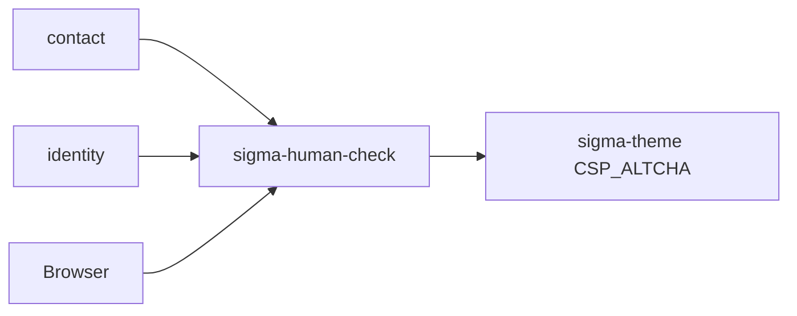

# sigma-human-check architecture

`sigma-human-check` is the self-hosted human-verification library for Sigma public forms. It implements the ALTCHA proof-of-work protocol locally so contact and registration endpoints need no third-party CAPTCHA API.

## Context

This library owns no database and no runtime process of its own.

## Runtime shape

`sigma-human-check` is a Rust library crate consumed as a git dependency. Services call `HumanCheck::from_env()` once at startup and mount challenge routes through optional `axum` or `warp` feature modules. Form handlers call `verify_payload()` on submitted ALTCHA fields.

## Request flow

Browsers fetch `GET /human-check/challenge` to receive a signed PoW challenge, solve it client-side, and submit the payload with the form. `verify_payload()` validates the signature and solution before the service accepts `POST /contact` or `POST /register`. When disabled, verification is skipped and a warning is logged.

## Code map

| Path | Responsibility |
| --- | --- |
| `src/lib.rs` | Public re-exports and user-safe rejection messages. |
| `src/human_check.rs` | Env loading, challenge issue, and payload verification. |
| `src/human_check_error.rs` | Error types for config and verification failures. |
| `src/altcha_payload.rs` | Client and server-signature payload parsing. |
| `src/axum.rs` | Axum challenge handler (`axum` feature). |
| `src/warp.rs` | Warp challenge routes and filter helpers (`warp` feature). |

The ALTCHA widget template lives in `sigma-theme` at `assets/templates/widgets/human_check.html`.

## Data

The library holds no persistent state. Challenges are stateless HMAC-signed payloads with embedded expiry; verification recomputes the PoW without server-side session storage.

## Configuration

| Environment variable | Purpose |
| --- | --- |
| `HUMAN_CHECK_DISABLED` | When truthy (`1`, `true`, `yes`), skips verification and logs a warning. |
| `HUMAN_CHECK_HMAC_SECRET` | HMAC signing secret (≥32 characters when enabled). |
| `HUMAN_CHECK_KEY_SECRET` | Key signature secret (≥32 characters when enabled). |
| `HUMAN_CHECK_COST` | PoW difficulty (default `5000`). |
| `HUMAN_CHECK_TTL_SECS` | Challenge lifetime in seconds (default `600`). |

Startup fails when secrets are missing or too short unless `HUMAN_CHECK_DISABLED` is explicitly set.

## Deployment

There is no container image. Consuming services set `HUMAN_CHECK_*` variables in their platform Secrets or local `.env` files. Contact uses the `warp` feature; identity registration uses the `axum` feature.

## Testing

Run `cargo test --all-targets` in the human-check workspace. Tests cover disabled mode, secret validation, round-trip PoW at reduced cost, and empty-payload rejection. Uses `temp-env` to isolate environment blocks.

## Design notes

- Two safe production states: fully configured secrets, or explicitly disabled — no silent accept-all fallback.
- Privacy-friendly: no third-party cookies, fingerprinting, or vendor SDK.
- Integrates with `sigma-theme` CSP via `CSP_ALTCHA` for `worker-src` requirements.
